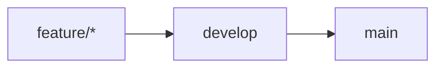

# Contributing to Hermes

Thank you for your interest in contributing to Hermes.

Hermes is an open-source web-based API client currently under active
development. Contributions are welcome through issues and pull requests.

---

## Development Workflow

Hermes follows a feature-branch workflow.



### `main`

`main` contains stable release versions.
Feature development should not be pushed directly to `main`.

### `develop`

develop is the integration branch for completed development work and the
source branch for upcoming releases.

### `feature/*`

Feature branches are used for individual features, fixes, refactors, and other
development work.

### Examples:

```text
feature/authentication
feature/request-builder
feature/collections
feature/request-history
feature/environment-variables
```

---

## Before You Start

Before starting work:

1. Check existing issues and pull requests.
2. For larger changes, open or discuss an issue first.
3. Make sure your local develop branch is up to date.
4. Create a dedicated feature branch.

---

## Creating a Feature Branch

Start from the latest develop branch.

```bash
git checkout develop
git pull origin develop
git checkout -b feature/<short-description>
```

Keep the branch focused on a single logical change whenever possible.

---

## Making Changes

When working on Hermes:

- Follow the existing project structure.
- Prefer TypeScript for application code.
- Reuse existing components and utilities where appropriate.
- Avoid unnecessary dependencies.
- Keep changes focused and reviewable.
- Update documentation when behavior or setup changes.
- Do not commit secrets or environment files.

---

## Database Changes

Hermes uses PostgreSQL with Prisma.
When modifying the database schema:

1. Update prisma/schema.prisma.
2. Create the appropriate Prisma migration.
3. Review the generated migration.
4. Test the migration locally.
5. Include the migration in the pull request.
   For development migrations:

```bash
npx prisma migrate dev
```

To apply existing migrations:

```bash
npx prisma migrate deploy
```

Database changes should not be made directly in production without a
corresponding migration.

---

## Environment Variables

Never commit:

- `.env`
- OAuth secrets
- API keys
- Database passwords
- Session secrets
- Access tokens
- Other private credentials

Use `.env.example` to document required configuration.
When adding a new environment variable:

1. Add it to the appropriate environment configuration.
2. Add a safe placeholder to `.env.example`.
3. Update the relevant documentation.
4. Never commit the real value.

---

## Authentication Changes

Authentication is security-sensitive.
Changes involving authentication should be tested carefully, especially:

- Sign-in flows
- OAuth callbacks
- Sessions
- Protected routes
- User/account handling
- Authentication configuration

Do not include real OAuth credentials or session information in commits,
screenshots, logs, issues, or pull requests.

---

## Code Quality

Before submitting a pull request, run the relevant validation commands:

```bash
npm run lint
npx tsc --noEmit
npm run build
```

If your changes affect the database, also verify the Prisma migrations.
For UI changes, manually test the affected flows in the browser.

---

## Commit Messages

Use clear and descriptive commit messages.
Preferred format:

```text
type: short description
```

Common types include:

```text
feat: add request builder
fix: handle expired sessions
refactor: simplify authentication module
docs: update setup instructions
chore: update dependencies
ci: update build workflow
```

The commit message should describe the change rather than only referencing an
issue number.

---

## Issues

Use the appropriate issue template when creating an issue.

### Bug Reports

Use the Bug Report template for unexpected or incorrect behavior.
Include:

- What happened
- Expected behavior
- Steps to reproduce
- Environment information
- Relevant logs or screenshots

### Feature Requests

Use the Feature Request template for new functionality.
Explain:

- The problem being solved
- The proposed solution
- Expected behavior
- Acceptance criteria

### Refactors

Use the Refactor template for structural or technical improvements that
primarily improve the codebase without introducing a new user-facing feature.

---

## Pull Requests

Feature branches should target:

```text
feature/* → develop
```

Release pull requests should target:

```text
develop → main
```

Do not merge feature branches directly into main unless the repository
maintainer explicitly decides otherwise.

---

## Pull Request Checklist

Before opening a pull request:

- [ ] The branch is based on the latest `develop`.
- [ ] The change is focused and does not contain unrelated work.
- [ ] The code has been reviewed locally.
- [ ] Linting passes.
- [ ] Type checking passes.
- [ ] The production build passes.
- [ ] Database migrations have been tested when applicable.
- [ ] Authentication flows have been tested when applicable.
- [ ] UI changes have been manually verified when applicable.
- [ ] Documentation has been updated when necessary.
- [ ] No secrets or `.env` files are included.
- [ ] Temporary debug code has been removed.

---

## Pull Request Expectations

A good pull request should:

- Have a clear title.
- Explain why the change is needed.
- Describe what changed.
- Explain how the change was tested.
- Mention database changes when applicable.
- Mention authentication or security-sensitive changes when applicable.
- Include screenshots or recordings for relevant UI changes.
- Keep unrelated changes out of scope.

---

## Documentation

Documentation should be updated when a change affects:

- Installation
- Environment variables
- Authentication
- Database setup
- Development workflow
- Public application behavior
- Security requirements
- Project architecture

---

## Security

Do not publicly disclose security vulnerabilities through GitHub issues.
For security-related reports, follow the instructions in
[SECURITY.md](./SECURITY.md).

---

## Code of Conduct

Please be respectful and constructive when participating in the project.
Treat contributors, maintainers, and users with professionalism and respect.
