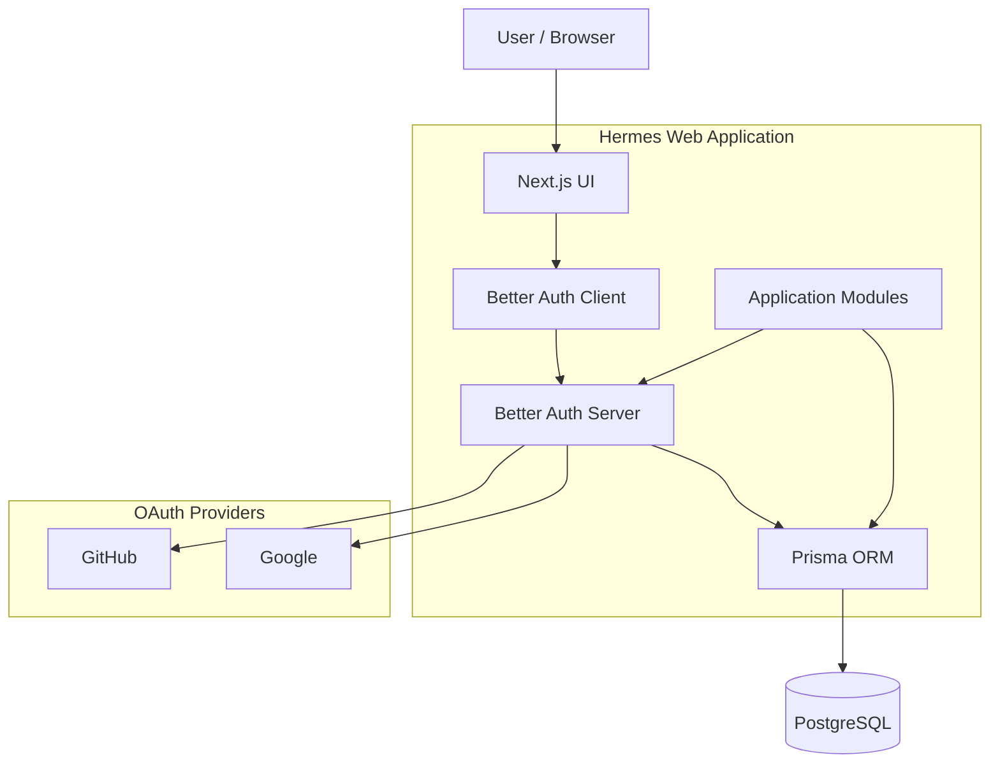
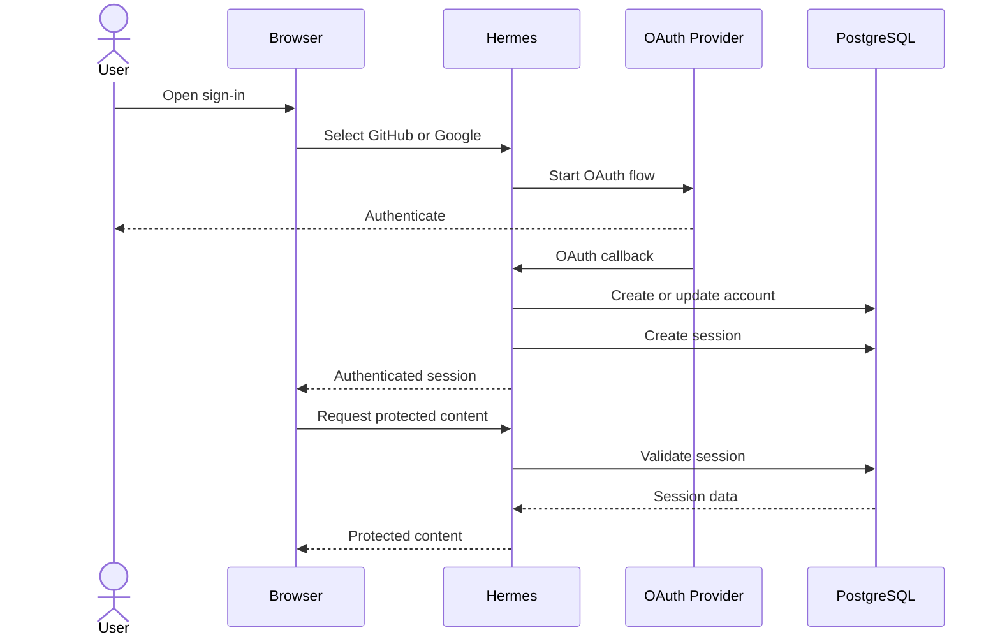
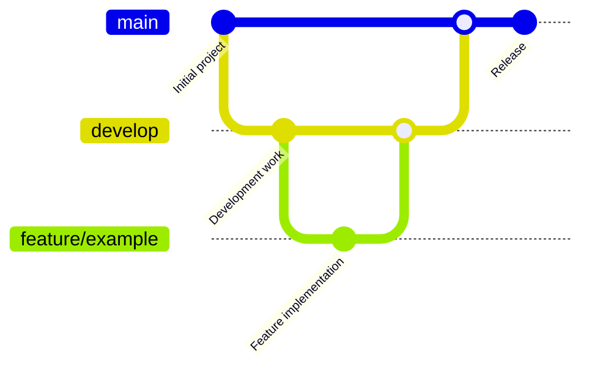
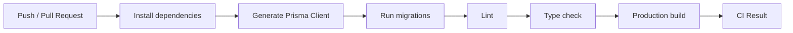

# Hermes

> A modern web-based API client inspired by Postman.

Hermes is a web-based API client focused on providing a clean and
developer-friendly environment for working with APIs directly from the browser.

The project is currently in early development. The current release focuses on
the application foundation, authentication, database integration, and
development infrastructure that will support the API client features planned
for future releases.

---

## Project Status

🚧 **Early Development**

Hermes is actively under development.

### Current Capabilities

- GitHub OAuth authentication
- Google OAuth authentication
- Session management
- Authenticated user handling
- PostgreSQL database integration
- Prisma ORM integration
- Database-backed authentication
- Authentication client hooks
- Authentication UI
- Docker-based local PostgreSQL setup
- Automated CI checks
- CodeQL security analysis
- GitHub issue and pull request templates

### Planned Capabilities

- HTTP request builder
- GET, POST, PUT, PATCH, and DELETE requests
- Request headers
- Query parameters
- Request body editor
- Response viewer
- Request collections
- Request history
- Environment variables
- Saved requests
- API documentation
- Workspace support

> Features listed under the planned capabilities are not considered
> implemented until they are released.

---

## Architecture

The current Hermes architecture consists of a Next.js application layer,
authentication services, Prisma, and PostgreSQL.



---

## Authentication Flow

Hermes currently uses Better Auth for authentication, with GitHub and Google
as OAuth providers and PostgreSQL as persistent storage through Prisma.



---

## Tech Stack

| Category          | Technology                |
| ----------------- | ------------------------- |
| Framework         | Next.js                   |
| Language          | TypeScript                |
| UI                | React                     |
| Styling           | Tailwind CSS              |
| Authentication    | Better Auth               |
| Database          | PostgreSQL                |
| ORM               | Prisma                    |
| Database Adapter  | Prisma PostgreSQL adapter |
| Validation        | Zod                       |
| Local Database    | Docker Compose            |
| CI                | GitHub Actions            |
| Security Analysis | CodeQL                    |

---

## Repository Structure

```text
.
├── .github/
│   ├── ISSUE_TEMPLATE/
│   │   ├── bug_report.md
│   │   ├── feature_request.md
│   │   └── refactor.md
│   ├── workflows/
│   │   ├── ci.yml
│   │   └── quality.yml
│   └── PULL_REQUEST_TEMPLATE.md
│
├── prisma/
│   ├── migrations/
│   └── schema.prisma
│
├── public/
│
├── src/
│   ├── app/
│   │   ├── (auth)/
│   │   │   └── sign-in/
│   │   ├── api/
│   │   │   └── auth/
│   │   └── page.tsx
│   │
│   ├── components/
│   │   └── ui/
│   │
│   ├── hooks/
│   │
│   ├── lib/
│   │   ├── auth-client.ts
│   │   ├── auth.ts
│   │   ├── db.ts
│   │   ├── env.ts
│   │   └── utils.ts
│   │
│   └── modules/
│       └── authentication/
│           ├── actions/
│           └── components/
│
├── docker-compose.yml
├── next.config.ts
├── package.json
├── prisma.config.ts
└── tsconfig.json
```

---

## Getting Started

### Prerequisites

Make sure the following are installed:

- Node.js 20+
- npm
- Docker
- Git

A local PostgreSQL installation is not required when using the provided
Docker Compose configuration.

---

## Installation

Clone the repository:

```bash
git clone <repository-url>
cd hermes
```

Install dependencies:

```bash
npm install
```

---

## Environment Variables

Create a local environment file:

```bash
cp .env.example .env
```

Configure the required variables before starting the application.

### Required Variables

| Variable               | Description                                     |
| ---------------------- | ----------------------------------------------- |
| `DATABASE_URL`         | PostgreSQL connection string                    |
| `POSTGRES_PASSWORD`    | Password used by the local PostgreSQL container |
| `GITHUB_CLIENT_ID`     | GitHub OAuth client ID                          |
| `GITHUB_CLIENT_SECRET` | GitHub OAuth client secret                      |
| `GOOGLE_CLIENT_ID`     | Google OAuth client ID                          |
| `GOOGLE_CLIENT_SECRET` | Google OAuth client secret                      |

Never commit `.env` or real credentials to the repository.

---

## Database Setup

Hermes provides Docker Compose configuration for running PostgreSQL locally.

Start the database:

```bash
docker compose up -d
```

The local PostgreSQL service is exposed on:

```text
127.0.0.1:5431
```

Generate the Prisma client:

```bash
npx prisma generate
```

Apply existing migrations:

```bash
npx prisma migrate deploy
```

For local schema development, create and apply a development migration with:

```bash
npx prisma migrate dev
```

---

## Running the Application

Start the development server:

```bash
npm run dev
```

Open the application at:

```bash
http://localhost:3000
```

---

## Available Scripts

| Command            | Purpose                      |
| ------------------ | ---------------------------- |
| `npm run dev`      | Start the development server |
| `npm run build`    | Create a production build    |
| `npm run start`    | Start the production server  |
| `npm run lint`     | Run ESLint                   |
| `npx tsc --noEmit` | Run TypeScript type checking |

---

## Development Workflow

Hermes uses a feature-branch workflow.



The intended branch flow is:

```text
feature/*
    ↓
develop
    ↓
main
```

### Branch Responsibilities

**`main`**

Contains stable releases.

**`develop`**

Contains completed development work intended for the next release.

**`feature/*`**

Used for individual features, fixes, refactors, and other development work.

Feature development should not be pushed directly to `main`.

---

## Continuous Integration

Hermes uses GitHub Actions for automated validation.

The CI workflow validates the application by:

1. Starting PostgreSQL.
2. Installing dependencies.
3. Generating the Prisma client.
4. Applying database migrations.
5. Running ESLint.
6. Running TypeScript type checking.
7. Building the application.



---

## Security

Hermes uses GitHub CodeQL for automated security analysis.

Security-sensitive configuration such as OAuth credentials must be provided
through environment variables.

For security reporting instructions, see
[SECURITY.md](./SECURITY.md).

---

## Contributing

Contributions are welcome.

Before contributing, read
[CONTRIBUTING.md](./CONTRIBUTING.md).

The repository provides issue templates for:

- Bug reports
- Feature requests
- Refactors

---

## Roadmap

The long-term goal of Hermes is to provide a complete browser-based API
development environment.

```mermaid
flowchart LR
    Foundation["Foundation"]
    Auth["Authentication"]
    Requests["Request Builder"]
    Response["Response Viewer"]
    Collections["Collections"]
    History["Request History"]
    Environments["Environments"]
    Collaboration["Collaboration"]

    Foundation --> Auth
    Auth --> Requests
    Requests --> Response
    Response --> Collections
    Collections --> History
    History --> Environments
    Environments --> Collaboration
```



### Current Milestone

**Foundation + Authentication**

Future milestones will be added as the corresponding functionality is
implemented.

---

## License

Hermes is distributed under the license specified in
[LICENSE](./LICENSE).

---

## Project Status

Hermes is a work in progress.

The roadmap describes planned functionality and should not be interpreted as a
list of currently available features.
